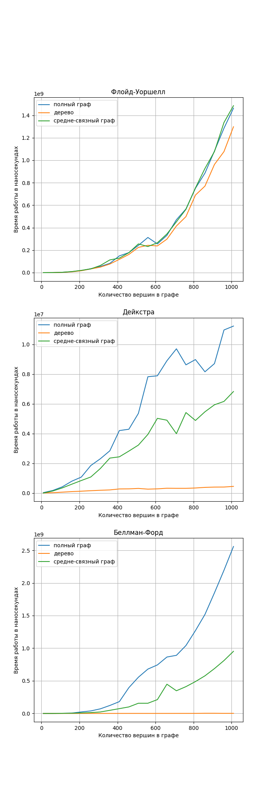
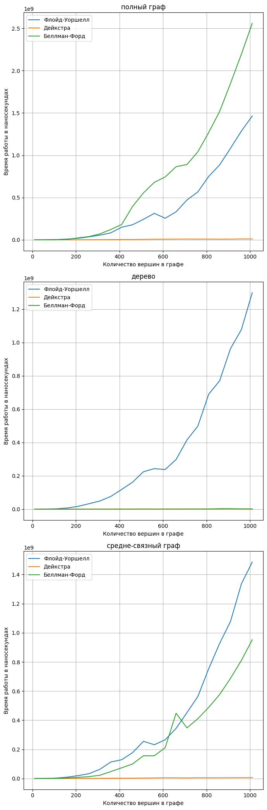

# Исследование алгоритмов поиска кратчайшего пути в графе

## Описание 

Были рассмотрены 3 алгоритма:
- Алгоритм Беллмана-Форда
- Алгоритм Дейкстры
- Алгоритм Флойда-Уоршелла

Для измерения времени работы генерировались графы с количеством вершин от 10 до 1010 с шагом 50 трех типов
- Полные графы
- Деревья
- Средне-связные графы(графы с коэффициентом плотности от 0.4 до 0.5)

Время работы измерялось в наносекундах

Некоторые параметры(например, пределы для генерации графов, количество тестов и другие) можно настроить в файле [config.h](./config.h)

Для генерации графиков нужно запустить [script.py](./script.py)

## Результаты

Результаты исследования были записаны в файл [vertices.csv](./vertices.csv)

По ним были построены графики:

1. Время работы для разных типов графов у конкретного алгоритма

2. Время работы для разных алгоритмов при конкретном виде графа

## Выводы

- Видно, что не зависимо от типа графа алгоритм Флойда-Уоршелла работает одинаковое время. Это объясняется тем, что алгоритм представляет из себя 3 цикла по количеству вершин, в которых никак не учитывается количество ребер
- Алгоритмы Дейкстры и Беллмана-Форда работают быстрее на менее плотных графах. Для Беллмана-Форда это очевидно, так как в нем идет цикл по всем ребрам. Для Дейкстры это объясняется тем, что на каждой итерации алгоритма мы смотрим на всех соседей и чем более плотный граф тем их больше
- Для всех типов графов алгоритм Дейкстры работал быстрее всех 
- Алгоритм Беллмана-Форда явно не стоит использовать на плотных графах
- Алгоритм Флойда-Уоршелла в принципе не стоит использовать, если нужно найти расстояние между одной парой точек

