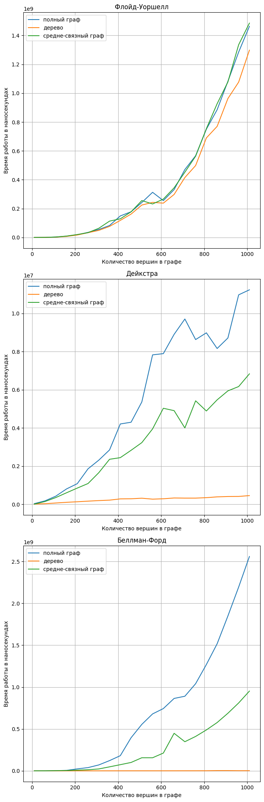

# Исследование алгоритмов поиска кратчайшего пути в графе

## Описание 

Были рассмотрены 3 алгоритма:
- Алгоритм Беллмана-Форда
- Алгоритм Дейкстры
- Алгоритм Флойда-Уоршелла

Для измерения времени работы генерировались графы с количеством вершин от 10 до 1010 с шагом 50 трех типов
- Полные графы
- Деревья
- Средне-связные графы(графы с коэффициентом плотности от 0.4 до 0.5)

Время работы измерялось в наносекундах

Некоторые параметры(например, пределы для генерации графов, количество тестов и другие) можно настроить в файле [config.h](./config.h)

Для генерации графиков нужно запустить [script.py](./script.py)

## Результаты

Результаты исследования были записаны в файл [vertices.csv](./vertices.csv)

По ним были построены графики:

1. Время работы для разных типов графов у конкретного алгоритма

2. Время работы для разных алгоритмов при конкретном виде графа

